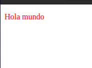
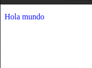
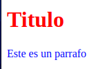
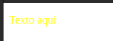
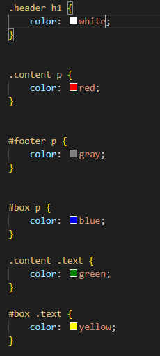

TALLER DE ESPECIFICIDAD

Parte 1: Introducción Teórica a la Especificidad (15 minutos)
    
    1. ¿Qué es la especificidad?
    2. Reglas del cálculo de la especificidad
    enlace para ver las diapositivas https://www.canva.com/design/DAGUmyIu8SY/HpwCYIlopKwYHYfDF4wDkA/view?utm_content=DAGUmyIu8SY&utm_campaign=designshare&utm_medium=link&utm_source=editor

Parte 2: Ejemplos Prácticos (30 minutos)

    1. Ejemplo Basico

    2. Demostración de !important

Parte 3: Ejercicios Prácticos (45 minutos)

    1. Calculando la especifidad
        ¿Que color tendria el titulo <h1>?
            Tendria el color rojo

    2. Resolviendo conflictos de especifidad

Parte 4: Desafío Final (30 minutos)

    Desafío: Diseñando una Página Completa con Estilos Conflictivos
        El <h1> en el .header debe ser de color blanco.
        El texto del 
 en .content debe ser rojo.
        El texto del <footer> debe ser gris.
        

